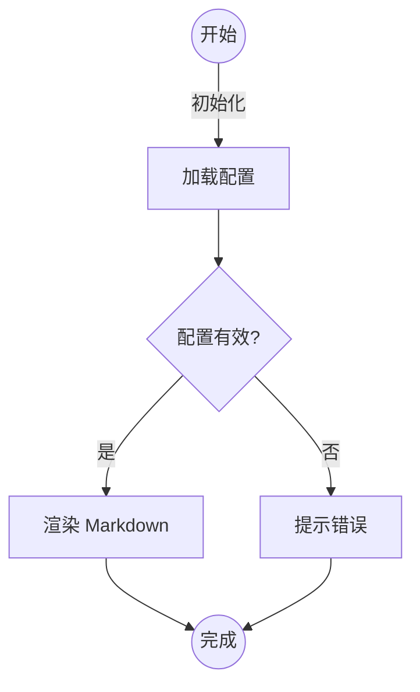

# Markdown 综合演示指南

> **目的说明**：这篇长文章覆盖常见和扩展 Markdown 语法，便于在界面中测试渲染效果。[阅读须知](#附录) 将提供额外说明与参考链接。
>
> > 嵌套引用同样展示。
>
> 使用 Markdown 时请注意空行和缩进，这是渲染正确与否的关键。本文中的每一段落都包含示例、提示或练习。

<!-- 这一段 HTML 注释用于测试对注释的处理 -->

## 目录
- [Markdown 综合演示指南](#markdown-综合演示指南)
  - [目录](#目录)
  - [基础排版](#基础排版)
    - [多级标题示例](#多级标题示例)
- [一级标题示例](#一级标题示例)
  - [二级标题示例](#二级标题示例)
    - [三级标题示例](#三级标题示例)
      - [四级标题示例](#四级标题示例)
        - [五级标题示例](#五级标题示例)
          - [六级标题示例](#六级标题示例)
    - [正文排版](#正文排版)
  - [段落与换行](#段落与换行)
  - [强调与内联元素](#强调与内联元素)
  - [列表示例](#列表示例)
    - [无序列表](#无序列表)
    - [有序列表](#有序列表)
    - [任务清单](#任务清单)
  - [代码示例](#代码示例)
    - [行内代码](#行内代码)
    - [缩进式代码块](#缩进式代码块)
    - [围栏代码块](#围栏代码块)
  - [表格与对齐](#表格与对齐)
  - [链接、图像与自动链接](#链接图像与自动链接)
  - [任务清单与引用块](#任务清单与引用块)
  - [注脚与定义列表](#注脚与定义列表)
  - [分隔线与其他语法](#分隔线与其他语法)
  - [兼容性拓展](#兼容性拓展)
  - [附录](#附录)
    - [参考资料](#参考资料)
    - [结束语](#结束语)

## 基础排版
### 多级标题示例
# 一级标题示例
## 二级标题示例
### 三级标题示例
#### 四级标题示例
##### 五级标题示例
###### 六级标题示例

在真实文档中，标题一般按照层级结构逐级推进。若仅用一个 `#` 表示 H1，其余以此类推。

### 正文排版
Markdown 的正文段落无需额外标记，通过空行进行分段。以下展示一个包含中文与英文的长段落：

Markdown 语法以简洁著称。When writing documentation, you can mix English and 中文 seamlessly, ensuring the reader understands the context clearly. 使用自然的语言描述问题，再统一总结解决方案，以便读者快速吸收信息。

## 段落与换行
默认情况下，Markdown 会将同一段中的换行合并。如果需要强制换行，可在行尾添加两个空格。示例如下：
第一行带有强制换行的文本。  
第二行与第一行属于同一段落，但渲染时会换行。

如果只按 `Enter` 换行而不添加空格，渲染时会变成两个段落。

## 强调与内联元素
- 斜体：使用 `*单星号*` 或 `_下划线_` 表示 *强调*。
- 粗体：使用 `**双星号**` 表示 **重点**。
- 粗斜体：`***三重星号***` 表示 ***强烈强调***。
- 删除线：`~~波浪线~~` 得到 ~~已废弃信息~~。
- 下划线可以通过 HTML `<u>标签</u>` 达成，<u>如下所示</u>。
- 高亮可用 `<mark>` 标签，如 <mark>重点提示</mark>，用于兼容支持 HTML 的渲染器。
- 行内代码：使用反引号包裹，如 `const answer = 42`。
- 符号转义：如果需要展示星号而不是强调，可写成 `\*字面星号\*`，渲染后得到 \*字面星号\*。
- 内联数学（如果渲染器支持）：`$E = mc^2$`。

## 列表示例
### 无序列表
- 第一项内容，包含额外说明。
  - 嵌套子项一。
  - 嵌套子项二，内含 `inline code`。
- 第二项内容，延伸描述。
- 第三项内容，带有强调 **重点**。

### 有序列表
1. 准备环境：确认 Node.js、包管理器和文档源文件。
2. 执行命令：运行 `yarn dev` 观察实时更新。
   1. 若启动失败，请检查端口是否被占用。
   2. 若需要自定义端口，可使用 `yarn dev --port 4321`。
3. 校验结果：检查浏览器渲染是否符合预期。

### 任务清单
- [x] 阅读语法概览
- [x] 准备示例文档
- [ ] 进行可视化测试
- [ ] 收集反馈并迭代

## 代码示例
### 行内代码
使用 `pnpm install` 或 `npm install` 来拉取依赖。

### 缩进式代码块
    function legacyIndent() {
        console.log('这是以四个空格缩进的代码块。');
    }

### 围栏代码块
```ts
interface User {
  id: number
  name: string
  roles: string[]
}

const currentUser: User = {
  id: 1,
  name: 'Coder',
  roles: ['author', 'tester'],
}

console.info('用户数据', currentUser)
```

```bash
# 终端命令示例
pnpm run build
```

```json
{
  "name": "markdown-sample",
  "version": "1.0.0",
  "scripts": {
    "dev": "vite",
    "build": "vite build"
  }
}
```

## 表格与对齐
下表展示了三列表格，并演示左对齐、居中、右对齐：

| 语言 | 熟练度 | 备注 |
| :--- | :----: | ---: |
| JavaScript | ⭐⭐⭐⭐ | 前端主力 |
| TypeScript | ⭐⭐⭐⭐ | 强类型支持 |
| Markdown | ⭐⭐⭐⭐⭐ | 文档首选 |

表格可以包含行内代码，例如 `\n`，也可以结合表情符号如 :sparkles: 展示丰富内容。

## 链接、图像与自动链接
- 行内链接示例：[Vue 官方文档](https://vuejs.org)
- 引用式链接示例请见 [扩展阅读][markdown-guide]
- 自动链接：<https://developer.mozilla.org>
- 邮件链接：<mailto:hello@example.com>
- 图片示例：

同时可以组合链接与强调，例如 **[项目仓库](https://github.com/)**。

## 任务清单与引用块
> 小贴士：引用块内部也可以包含列表。
>
> - [x] 在引用中展示任务
> - [ ] 未完成项
>
>     ```bash
>     echo "嵌套在引用中的代码块"
>     ```

## 注脚与定义列表
这是一个包含注脚的句子，对渲染器来说非常重要[^footnote-important]。第二个注脚也会给出更多示例[^another-note]。

术语一
: 这是一个定义列表条目，用冒号开头。

术语二
: 可以包含多行说明。
  第二行需要缩进以保持定义关系。

[^footnote-important]: 注脚内容可以包含 **粗体**、链接或其他 Markdown。
[^another-note]: 使用多个注脚时，请确保锚点唯一。

## 分隔线与其他语法
下面展示三种常见分隔线写法：

---
***
___

- HTML 内联元素示例：<sup>上标</sup> 与 <sub>下标</sub>。
- 表情与短代码：:tada: :rocket:。
- 任务列表再次出现以确认渲染稳定：
  - [x] 第一项
  - [ ] 第二项

## 兼容性拓展
某些渲染器支持额外语法。例如 GitHub 风格的表格、任务列表与删除线已经在上文演示。下面再补充一个围栏块标注语言为 `mermaid` 的示例，如果页面集成了相应插件就能渲染流程图：



Markdown 还可以内嵌数学公式（若渲染器支持 KaTeX 或 MathJax）：

```math
F(x) = \int_{-\infty}^{\infty} \hat f(\xi) e^{2\pi i x \xi} \, d\xi
```

## 附录
### 参考资料
- [CommonMark 规范](https://spec.commonmark.org/)
- [Markdown Guide][markdown-guide]
- [GFM 扩展说明](https://github.github.com/gfm/)

### 结束语
感谢阅读这篇集合了 Markdown 核心语法与扩展特性的长文。请根据需要修改、扩充或删减内容，以适配你的测试场景。如果发现遗漏的语法或新扩展，欢迎继续补充，让这份示例文档保持最新状态。

[markdown-guide]: https://www.markdownguide.org "Markdown Guide"
