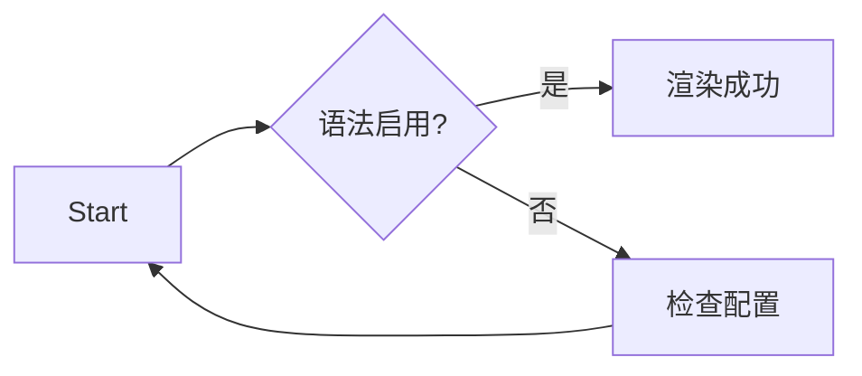

# Markdown 功能总览

> **使用说明**：此文档汇集 Markdown 常见语法，方便测试渲染效果。每个小节都可以直接在页面上对照查看。
>
> 内联数学：$E=mc^2$
>
> 目录导航请查看左侧侧边栏。

## 标题层级

# 一级标题
## 二级标题
### 三级标题
#### 四级标题
##### 五级标题
###### 六级标题

## 段落与强调
Markdown 段落之间使用**空行**分隔。可以混排 *斜体*、**粗体**、~~删除线~~、<u>下划线</u> 和 <mark>高亮</mark>。<br />在行末添加两个空格可以产生手动换行。符号需要转义时，例如 `\*星号\*`，请使用反斜杠。

## 列表示例

### 无序列表
- 顶层选项
  - 二级子项
    - 三级子项
- 支持 `inline code`

### 有序列表
1. 安装依赖：`pnpm install`
2. 启动项目：`pnpm run dev`
3. 打开浏览器查看效果

### 任务清单
- [x] 支持 GitHub 风格语法
- [x] 默认会渲染为复选框
- [ ] 未完成的项目保持待办状态

## 代码示例

```ts
interface User {
  id: number
  name: string
  roles: string[]
}
```

```bash
# 常见命令
pnpm run build
```

## 表格与对齐

| 功能 | 支持情况 | 备注 |
| :--- | :----: | ---: |
| 标题层级 | ✅ | 最多 6 级 |
| 表格语法 | ✅ | 支持对齐与边框 |
| 任务清单 | ✅ | 使用 `- [ ]` 语法 |

> 提示：表格使用 GFM 语法，配合样式可展示边框与斑马纹。

## 链接与媒体
- 行内链接：[Markdown Guide](https://www.markdownguide.org/)
- 自动链接：<https://vuejs.org>
- 邮件链接：<mailto:hello@example.com>
- 图片示例：

## 数学公式
使用 MathJax 支持行内和块级公式：

- 行内：爱因斯坦质能方程 $E=mc^2$
- 块级：
  $$
  F(x) = \int_{-\infty}^{\infty} \hat f(\xi) e^{2\pi i x \xi} \, d\xi
  $$

## 区块示例
> 嵌套引用示例：
> - 支持任务清单
> - [x] 在引用内勾选
> - [ ] 未完成项目
>
> ```bash
> echo "引用中的代码块"
> ```

## 定义列表与脚注
术语 A
: 解释 A

术语 B
: 第一行
  第二行需要缩进。

脚注语法[^note] 也被支持。

[^note]: 这是一个脚注示例。

## 分隔线
---
***
___

## Mermaid 流程图


## 结语
随时根据测试需求扩充此文档。如果某些语法没有正常渲染，请检查 `markdown-it` 插件或样式设置。
